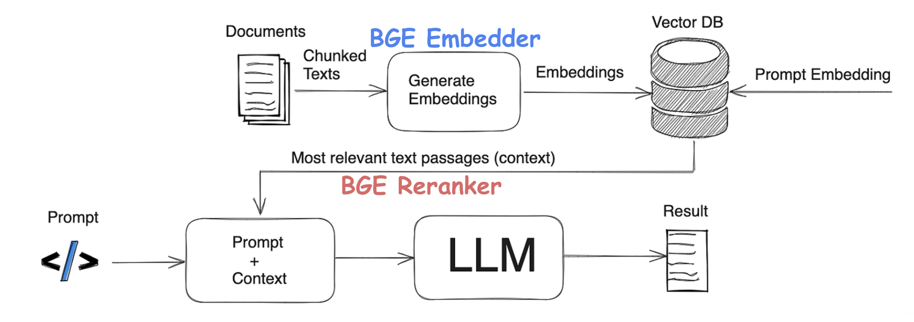

= BGE
:toc: manual

* BGE(BAAI General Embeddings) provide one-stop retrieval toolkit for search and RAG.
* https://www.baai.ac.cn/

== Semantics Information Retrieval

* Similarity between 'watch a play' and 'play with a watch': 0.6953
* Similarity between 'I’m deeply in love with you' and 'You mean the world to me': 0.6362 
* Similarity between 'I love you' and 'I hate you': 0.6318
* Similarity between 'The cat is sleeping under the sofa' and 'Quantum entanglement affects subatomic particles in a vacuum': 0.2561
* Similarity between 'I enjoy watching movies on weekends' and 'Photosynthesis is the process by which plants make food': 0.3394

=== Corpus & Query

[source, bash]
.*Corpus*
----
[
    "Michael Jackson was a legendary pop icon known for his record-breaking music and dance innovations.",
    "Fei-Fei Li is a professor in Stanford University, revolutionized computer vision with the ImageNet project.",
    "Brad Pitt is a versatile actor and producer known for his roles in films like 'Fight Club' and 'Once Upon a Time in Hollywood.'",
    "Geoffrey Hinton, as a foundational figure in AI, received Turing Award for his contribution in deep learning.",
    "Eminem is a renowned rapper and one of the best-selling music artists of all time.",
    "Taylor Swift is a Grammy-winning singer-songwriter known for her narrative-driven music.",
    "Sam Altman leads OpenAI as its CEO, with astonishing works of GPT series and pursuing safe and beneficial AI.",
    "Morgan Freeman is an acclaimed actor famous for his distinctive voice and diverse roles.",
    "Andrew Ng spread AI knowledge globally via public courses on Coursera and Stanford University.",
    "Robert Downey Jr. is an iconic actor best known for playing Iron Man in the Marvel Cinematic Universe.",
]
----

[source, bash]
.*Query*
----
"Who could be an expert of neural network?"
----

=== Embedder

[source, bash]
----
shape of the query embedding:   (768,)
shape of the corpus embeddings: (10, 768)
----

[source, bash]
.*Query embedding*
----
[-7.9041e-03 -6.8207e-03 -8.0948e-03 ... -6.1913e-03  3.8177e-02 -1.4717e-02]
----

[source, bash]
.*Corpus embeddings*
----
[[-3.668e-02  1.881e-03 -1.412e-03 ... -2.745e-02 -1.883e-02 -6.665e-02]
 [-5.463e-03 -2.040e-02 -1.083e-03 ...  1.004e-02  5.038e-02  9.529e-03]
 [-2.409e-03  3.702e-02  5.161e-03 ... -4.120e-02  2.374e-02 -5.121e-02]
 ...
 [-2.823e-02 -1.943e-05 -1.237e-02 ...  2.232e-02  5.127e-02  1.587e-02]
 [ 3.046e-02 -2.153e-02  1.649e-02 ...  1.378e-03  9.201e-03 -3.845e-02]
 [-1.337e-02  3.036e-02  2.333e-02 ...  4.536e-03  5.792e-02 -1.581e-02]]
----

=== Similarity

[source, bash]
.*Similarity Caculation*
----
[0.393  0.603  0.327  0.6084 0.3945 0.3533 0.4624 0.4019 0.5283 0.368 ]
----

[cols="1,4,1,2", options="header"]
.*Corpus Summary*
|===
|Index |Sentence Summary |Similarity |Relevance to Query

|0 |Michael Jackson – legendary pop icon |0.3930 |❌ Irrelevant
|1 |Fei-Fei Li – revolutionized computer vision with ImageNet |0.6030 |✅ Highly relevant (CV & ML expert)
|2 |Brad Pitt – actor/producer |0.3270 |❌ Irrelevant
|3 |Geoffrey Hinton – foundational figure in AI, Turing Award, deep learning |0.6084 |✅ Highly relevant (neural network pioneer)
|4 |Eminem – rapper |0.3945 |❌ Irrelevant
|5 |Taylor Swift – singer-songwriter |0.3533 |❌ Irrelevant
|6 |Sam Altman – CEO of OpenAI, leads GPT development |0.4624 |🟡 Somewhat relevant (AI leader)
|7 |Morgan Freeman – actor |0.4019 |❌ Irrelevant
|8 |Andrew Ng – educator, Coursera & Stanford AI courses |0.5283 |✅ Relevant (AI & neural network educator)
|9 |Robert Downey Jr. – actor (Iron Man) |0.3680 |❌ Irrelevant
|===

[cols="1,1,2", options="header"]
.*Top 3 Candidates*
|===
|Name |Similarity |Why

|Geoffrey Hinton |0.6084 |Pioneer in neural networks and deep learning; won the Turing Award.
|Fei-Fei Li |0.6030 |Major contributions to computer vision and machine learning; founded ImageNet.
|Andrew Ng |0.5283 |Well-known AI educator and deep learning advocate.
|===

=== Reranker

[source, bash]
.*Reranking score*
----
[3, 1, 8, 6, 7, 4, 0, 9, 5, 2]
----

[source, bash]
.*Retrieval Result*
----
Geoffrey Hinton, as a foundational figure in AI, received Turing Award for his contribution in deep learning.
----

[source, bash]
.*Sorted indices*
----
Score of 0.608: "Geoffrey Hinton, as a foundational figure in AI, received Turing Award for his contribution in deep learning."
Score of 0.603: "Fei-Fei Li is a professor in Stanford University, revolutionized computer vision with the ImageNet project."
Score of 0.528: "Andrew Ng spread AI knowledge globally via public courses on Coursera and Stanford University."
Score of 0.462: "Sam Altman leads OpenAI as its CEO, with astonishing works of GPT series and pursuing safe and beneficial AI."
Score of 0.402: "Morgan Freeman is an acclaimed actor famous for his distinctive voice and diverse roles."
Score of 0.395: "Eminem is a renowned rapper and one of the best-selling music artists of all time."
Score of 0.393: "Michael Jackson was a legendary pop icon known for his record-breaking music and dance innovations."
Score of 0.368: "Robert Downey Jr. is an iconic actor best known for playing Iron Man in the Marvel Cinematic Universe."
Score of 0.353: "Taylor Swift is a Grammy-winning singer-songwriter known for her narrative-driven music."
Score of 0.327: "Brad Pitt is a versatile actor and producer known for his roles in films like 'Fight Club' and 'Once Upon a Time in Hollywood.'"
----

== Download Model From Hugging Face

[source, bash]
.*Set Token*
----
export HUGGINGFACE_HUB_TOKEN=your_token_here
----

* Set Token: https://huggingface.co/settings/tokens

[source, bash]
.*Set HF mirror*
----
export HF_ENDPOINT=https://hf-mirror.com
----

[source, bash]
.*Download Model*
----
huggingface-cli download BAAI/bge-base-en-v1.5 --local-dir ./bge_model
----

== Embedder

link:embedder/README.adoc[]
